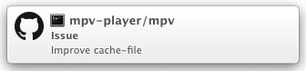

# github-notifier

github-notifier just gets GitHub's Notifications and sends them to OS X's Notification Center.

github-notifier makes up for [GitHub for Mac](https://mac.github.com/) (cf. [GitHub for Mac: Notifications](https://github.com/blog/1287-github-for-mac-notifications)).




## Requirements

* OS X >= 10.8
* Xcode >= 5.0
* ruby >= 2.1
* [octokit.rb](https://github.com/octokit/octokit.rb) (`gem install octokit`)
* [highline](https://github.com/JEG2/highline) (`gem install highline`)

## Installation

```sh
$ git clone https://github.com/henry0312/github-notifier.git
$ cd github-notifier
$ git submodule update --init --recursive
$ rake build
$ rake github.yml
Input Input API endpoint: |https://api.github.com|
Input Username:
Input Password:
$ rake load
```

If you use [Two-factor Authentication](https://github.com/blog/1614-two-factor-authentication), you have to create `github.yml` manually.

1. Get an access token from [Authorized applications](https://github.com/settings/applications)  
   NOTE1: The token must have the privilege to access notifications.  
   NOTE2: The privilege to repo and notifications is necessary.
2. Create `github.yml` as below

```yaml
- API_ENDPOINT: <somewhere>
  ACCESS_TOKEN: <your 40 char token>
  USER: <username>
```

## Uninstallation

```sh
$ rake unload
```

## Usage

### Change time interval

If you want to change time interval to get notifications, you need to change `INTERVAL` in `conf.rb` and run:

```sh
$ rake unload
$ rake load
```

### Update

```sh
$ rake update
$ rake build
```

### Add endpoint

```sh
$ rake unload
$ rake add
Input Input API endpoint: |https://api.github.com|
Input Username:
Input Password:
$ rake load
```

## Contributing

1. Fork it ( https://github.com/henry0312/github-notifier/fork )
2. Create your feature branch (`git checkout -b my-new-feature`)
3. Commit your changes (`git commit -am 'Add some feature'`)
4. Push to the branch (`git push origin my-new-feature`)
5. Create a new Pull Request

## Licence

MIT License  
Copyright (c) 2014 Tsukasa ŌMOTO
